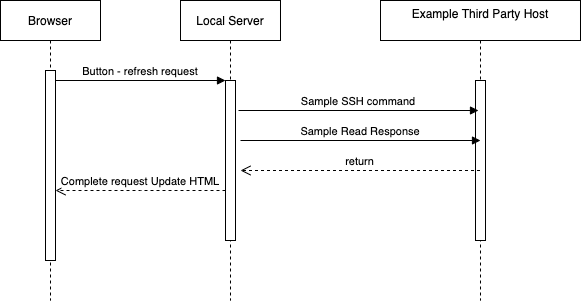

# html_benchmark

### Proof of concept project to demonstrate how web browser can be used for instrumentation UI

#### Overview
Web browser security models prevents them from being used directly to obtain external data required for instrumentation.
That is, client side javascript is sand-boxed to communicate only with its server.

A work around to this limitation is to include a small local sever on the same machine that proxies the browser request and returns the result
In this example, the client contains a "speedometer" control and a button. After the button is pressed the browser requests an update from the server.

The server then connects to external datasource, (in this case by ssh'ing into an external machine and running a sample command which stores the results in a temporary file.
The server then reads the temporary file.) The local server then completes the browser request.

Notes: In order to ssh to a remote machine without requiring username/password authentication, use keys via ssh-keygen/ ssh-copy-id
